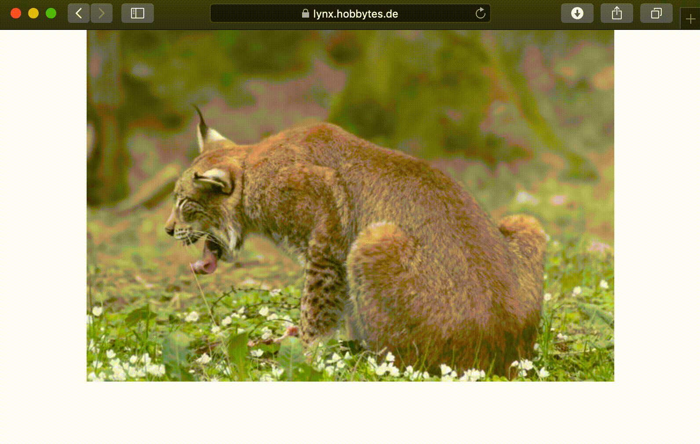

# lorem-lynx 😼
A fancy placeholder image provider with lynxes. They're cut and simply awesome. Did you see their brushes on their ears? Tremendous.



Live example: https://lynx.hobbytes.de/ or https://luchs.hobbytes.de/

Use the url query parameters to set metrics and type of the image you want.

Parameters `height` and `width` measures are pixel based integer values.

Possible types are `jpeg` and `png`

## Example Query

```
https://lynx.hobbytes.de/image?height=400&width=600&type=png
```

## Notice

License: **MIT**

Hendrik Ulbrich © 2019
